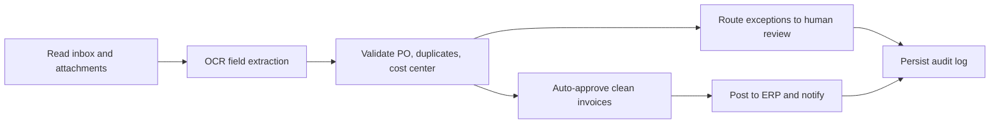

# invoice-processing-uipath

## Português

`invoice-processing-uipath` é um MVP técnico de automação de contas a pagar com mentalidade `UiPath`, desenhado para mostrar como um processo de recebimento de notas pode ser estruturado com OCR, validação de regras, fila de exceções e trilha de auditoria.

### Storytelling técnico

Em RPA, automatizar não é só clicar em telas. Em um processo de invoice processing, a automação precisa ler documentos, interpretar campos extraídos, comparar com dados de referência, separar exceções e registrar evidências suficientes para auditoria. É esse tipo de fluxo que o `UiPath` organiza muito bem em operações corporativas.

Este projeto representa esse desenho com dois elementos complementares:

- um artefato `UiPath-style` com [project.json](/Users/flaviagaia/Documents/CV_FLAVIA_CODEX/invoice-processing-uipath/project.json) e [Main.xaml](/Users/flaviagaia/Documents/CV_FLAVIA_CODEX/invoice-processing-uipath/workflows/Main.xaml);
- um simulador local em Python que reproduz a lógica operacional do processo e gera resultados reproduzíveis para portfólio.

### Fluxo automatizado



### Estrutura do projeto

- [project.json](/Users/flaviagaia/Documents/CV_FLAVIA_CODEX/invoice-processing-uipath/project.json)
- [workflows/Main.xaml](/Users/flaviagaia/Documents/CV_FLAVIA_CODEX/invoice-processing-uipath/workflows/Main.xaml)
- [src/sample_data.py](/Users/flaviagaia/Documents/CV_FLAVIA_CODEX/invoice-processing-uipath/src/sample_data.py)
- [src/pipeline.py](/Users/flaviagaia/Documents/CV_FLAVIA_CODEX/invoice-processing-uipath/src/pipeline.py)
- [main.py](/Users/flaviagaia/Documents/CV_FLAVIA_CODEX/invoice-processing-uipath/main.py)
- [tests/test_pipeline.py](/Users/flaviagaia/Documents/CV_FLAVIA_CODEX/invoice-processing-uipath/tests/test_pipeline.py)

### Lógica de negócio simulada

- notas com todos os campos, sem duplicidade, com centro de custo válido e valor coerente com a `PO` seguem como `auto_approved`;
- notas com baixa confiança de OCR, campos ausentes, divergência material de valor ou centro de custo inválido vão para `manual_review`;
- notas duplicadas são `blocked`.

### Resultados atuais

- `runtime_mode = uipath_style_local_simulation`
- `invoice_count = 6`
- `auto_approved = 1`
- `manual_review_queue = 4`
- `blocked = 1`
- `average_ocr_confidence = 0.9017`

### Artefatos gerados

- dataset de entrada:
  [data/raw/incoming_invoices.csv](/Users/flaviagaia/Documents/CV_FLAVIA_CODEX/invoice-processing-uipath/data/raw/incoming_invoices.csv)
- decisões do processo:
  [output/invoice_decisions.csv](/Users/flaviagaia/Documents/CV_FLAVIA_CODEX/invoice-processing-uipath/output/invoice_decisions.csv)
- relatório consolidado:
  [data/processed/invoice_processing_report.json](/Users/flaviagaia/Documents/CV_FLAVIA_CODEX/invoice-processing-uipath/data/processed/invoice_processing_report.json)

### Execução

```bash
python3 main.py
python3 -m unittest discover -s tests -v
python3 -m py_compile main.py src/sample_data.py src/pipeline.py
```

## English

`invoice-processing-uipath` is a technical MVP for accounts payable automation with a `UiPath` mindset, showing how invoice intake can be structured around OCR extraction, rule validation, exception routing, and auditability.

### Technical framing

The repository combines:

- a `UiPath-style` project definition through [project.json](/Users/flaviagaia/Documents/CV_FLAVIA_CODEX/invoice-processing-uipath/project.json) and [Main.xaml](/Users/flaviagaia/Documents/CV_FLAVIA_CODEX/invoice-processing-uipath/workflows/Main.xaml);
- a deterministic local simulator that reproduces the operational decision logic for portfolio validation.

### Current results

- `runtime_mode = uipath_style_local_simulation`
- `invoice_count = 6`
- `auto_approved = 1`
- `manual_review_queue = 4`
- `blocked = 1`
- `average_ocr_confidence = 0.9017`
