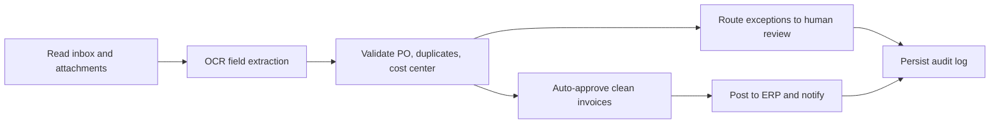

# invoice-processing-uipath

## Português

`invoice-processing-uipath` é um MVP técnico de automação de contas a pagar com mentalidade `UiPath`, desenhado para mostrar como um processo de recebimento de notas pode ser estruturado com OCR, validação de regras, fila de exceções e trilha de auditoria.

### Storytelling técnico

Em RPA, automatizar não é só clicar em telas. Em um processo de invoice processing, a automação precisa ler documentos, interpretar campos extraídos, comparar com dados de referência, separar exceções e registrar evidências suficientes para auditoria. É esse tipo de fluxo que o `UiPath` organiza muito bem em operações corporativas.

Este projeto representa esse desenho com dois elementos complementares:

- um artefato `UiPath-style` com [project.json](/Users/flaviagaia/Documents/CV_FLAVIA_CODEX/invoice-processing-uipath/project.json) e [Main.xaml](/Users/flaviagaia/Documents/CV_FLAVIA_CODEX/invoice-processing-uipath/workflows/Main.xaml);
- um simulador local em Python que reproduz a lógica operacional do processo e gera resultados reproduzíveis para portfólio.

### Objetivo arquitetural

O foco do projeto não é simular interface gráfica por si só, mas mostrar como um processo transacional de backoffice pode ser organizado em uma esteira auditável de RPA. Em termos de arquitetura, o fluxo foi desenhado para separar:

- captura do documento;
- extração de campos;
- validação contra regras operacionais;
- roteamento de exceções;
- persistência de evidências.

Essa separação é importante porque, em automações corporativas, o ganho de escala vem junto com a necessidade de controle: toda decisão automática precisa ser explicável, reproduzível e passível de revisão.

### Fluxo automatizado



### Estrutura do projeto

- [project.json](/Users/flaviagaia/Documents/CV_FLAVIA_CODEX/invoice-processing-uipath/project.json)
- [workflows/Main.xaml](/Users/flaviagaia/Documents/CV_FLAVIA_CODEX/invoice-processing-uipath/workflows/Main.xaml)
- [src/sample_data.py](/Users/flaviagaia/Documents/CV_FLAVIA_CODEX/invoice-processing-uipath/src/sample_data.py)
- [src/pipeline.py](/Users/flaviagaia/Documents/CV_FLAVIA_CODEX/invoice-processing-uipath/src/pipeline.py)
- [main.py](/Users/flaviagaia/Documents/CV_FLAVIA_CODEX/invoice-processing-uipath/main.py)
- [tests/test_pipeline.py](/Users/flaviagaia/Documents/CV_FLAVIA_CODEX/invoice-processing-uipath/tests/test_pipeline.py)

### Papel técnico de cada arquivo

- [project.json](/Users/flaviagaia/Documents/CV_FLAVIA_CODEX/invoice-processing-uipath/project.json)
  define o projeto `UiPath-style`, a workflow principal e as dependências esperadas do ecossistema.
- [Main.xaml](/Users/flaviagaia/Documents/CV_FLAVIA_CODEX/invoice-processing-uipath/workflows/Main.xaml)
  representa a sequência de alto nível do processo automatizado.
- [sample_data.py](/Users/flaviagaia/Documents/CV_FLAVIA_CODEX/invoice-processing-uipath/src/sample_data.py)
  materializa um lote sintético reproduzível de invoices, incluindo casos limpos e casos com exceção operacional.
- [pipeline.py](/Users/flaviagaia/Documents/CV_FLAVIA_CODEX/invoice-processing-uipath/src/pipeline.py)
  concentra a lógica de classificação do documento, decisão operacional e persistência dos artefatos.
- [main.py](/Users/flaviagaia/Documents/CV_FLAVIA_CODEX/invoice-processing-uipath/main.py)
  executa o fluxo completo e imprime o sumário consolidado.
- [test_pipeline.py](/Users/flaviagaia/Documents/CV_FLAVIA_CODEX/invoice-processing-uipath/tests/test_pipeline.py)
  valida o contrato principal do pipeline.

### Lógica de negócio simulada

- notas com todos os campos, sem duplicidade, com centro de custo válido e valor coerente com a `PO` seguem como `auto_approved`;
- notas com baixa confiança de OCR, campos ausentes, divergência material de valor ou centro de custo inválido vão para `manual_review`;
- notas duplicadas são `blocked`.

### Regras operacionais implementadas

Cada invoice é avaliada com base em um conjunto explícito de sinais:

- `has_required_fields`
  verifica se os campos mínimos necessários foram extraídos do documento;
- `duplicate_invoice`
  sinaliza tentativa de processamento repetido da mesma nota;
- `cost_center_valid`
  simula validação de consistência contábil;
- `invoice_amount - po_amount`
  mede divergência financeira contra a ordem de compra;
- `ocr_confidence`
  representa a qualidade da extração documental.

As regras são aplicadas de forma determinística e geram uma lista de `reasons`, o que permite reconstruir por que o documento foi aprovado, encaminhado para revisão ou bloqueado.

### Resultados atuais

- `runtime_mode = uipath_style_local_simulation`
- `invoice_count = 6`
- `auto_approved = 1`
- `manual_review_queue = 4`
- `blocked = 1`
- `average_ocr_confidence = 0.9017`

### Interpretação dos resultados

O benchmark atual foi desenhado para mostrar um lote pequeno, mas heterogêneo:

- apenas `1` invoice segue fluxo totalmente automático, o que representa o caso “happy path”;
- `4` invoices caem em `manual_review`, mostrando que a automação não força aprovação quando há baixa confiança ou inconsistência de negócio;
- `1` invoice é `blocked`, evidenciando o tratamento explícito de duplicidade como condição crítica.

Isso reforça uma característica importante de RPA bem desenhado: o objetivo não é automatizar tudo cegamente, e sim automatizar com segurança, roteando exceções para a fila certa.

### Artefatos gerados

- dataset de entrada:
  [data/raw/incoming_invoices.csv](/Users/flaviagaia/Documents/CV_FLAVIA_CODEX/invoice-processing-uipath/data/raw/incoming_invoices.csv)
- decisões do processo:
  [output/invoice_decisions.csv](/Users/flaviagaia/Documents/CV_FLAVIA_CODEX/invoice-processing-uipath/output/invoice_decisions.csv)
- relatório consolidado:
  [data/processed/invoice_processing_report.json](/Users/flaviagaia/Documents/CV_FLAVIA_CODEX/invoice-processing-uipath/data/processed/invoice_processing_report.json)

### Contrato do relatório final

O relatório consolidado registra:

- `runtime_mode`
- `invoice_count`
- `auto_approved`
- `manual_review_queue`
- `blocked`
- `average_ocr_confidence`
- `decision_artifact`
- `report_artifact`
- `workflow_artifact`

Esse contrato deixa o fluxo mais rastreável e facilita integração futura com dashboards, filas de trabalho ou camadas de observabilidade operacional.

### Como isso se traduziria para UiPath real

Em um runtime real de `UiPath`, a mesma lógica poderia ser distribuída entre atividades como:

- leitura de e-mails e anexos;
- classificação do documento;
- OCR e extração de campos;
- consulta de ERP ou planilha de `PO`;
- inserção em fila de exceções no `Orchestrator`;
- logging e envio de notificação.

O simulador em Python não substitui o Studio, mas torna a regra de decisão validável, testável e reproduzível fora do ambiente visual.

### Execução

```bash
python3 main.py
python3 -m unittest discover -s tests -v
python3 -m py_compile main.py src/sample_data.py src/pipeline.py
```

## English

`invoice-processing-uipath` is a technical MVP for accounts payable automation with a `UiPath` mindset, showing how invoice intake can be structured around OCR extraction, rule validation, exception routing, and auditability.

### Technical framing

The repository combines:

- a `UiPath-style` project definition through [project.json](/Users/flaviagaia/Documents/CV_FLAVIA_CODEX/invoice-processing-uipath/project.json) and [Main.xaml](/Users/flaviagaia/Documents/CV_FLAVIA_CODEX/invoice-processing-uipath/workflows/Main.xaml);
- a deterministic local simulator that reproduces the operational decision logic for portfolio validation.

### Architectural intent

The core idea is to model invoice automation as a controlled operational pipeline instead of a simple click-based script. The flow is intentionally separated into:

- document intake;
- OCR-like extraction quality;
- business-rule validation;
- exception routing;
- audit artifact persistence.

That separation mirrors how mature RPA processes are usually implemented in production environments.

### Rule engine semantics

Each invoice is evaluated through deterministic checks over:

- required fields availability;
- duplicate detection;
- cost center consistency;
- purchase order amount mismatch;
- OCR confidence.

The decision layer produces both a final `status` and an explicit list of `reasons`, which makes the workflow easier to audit and troubleshoot.

### Current results

- `runtime_mode = uipath_style_local_simulation`
- `invoice_count = 6`
- `auto_approved = 1`
- `manual_review_queue = 4`
- `blocked = 1`
- `average_ocr_confidence = 0.9017`

### Generated artifacts

- [data/raw/incoming_invoices.csv](/Users/flaviagaia/Documents/CV_FLAVIA_CODEX/invoice-processing-uipath/data/raw/incoming_invoices.csv)
- [output/invoice_decisions.csv](/Users/flaviagaia/Documents/CV_FLAVIA_CODEX/invoice-processing-uipath/output/invoice_decisions.csv)
- [data/processed/invoice_processing_report.json](/Users/flaviagaia/Documents/CV_FLAVIA_CODEX/invoice-processing-uipath/data/processed/invoice_processing_report.json)

### Runtime note

This repository is `UiPath-style` rather than a full UiPath Studio export with validated desktop execution. The visual workflow artifact and the local deterministic simulator are meant to show process design, rule structure, and operational traceability in a portfolio-friendly format.
